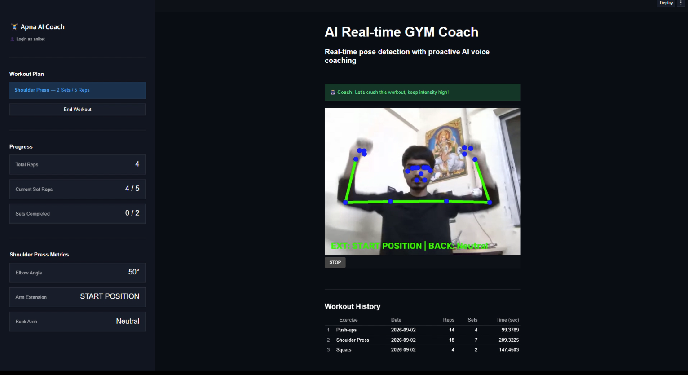
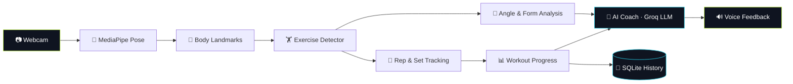
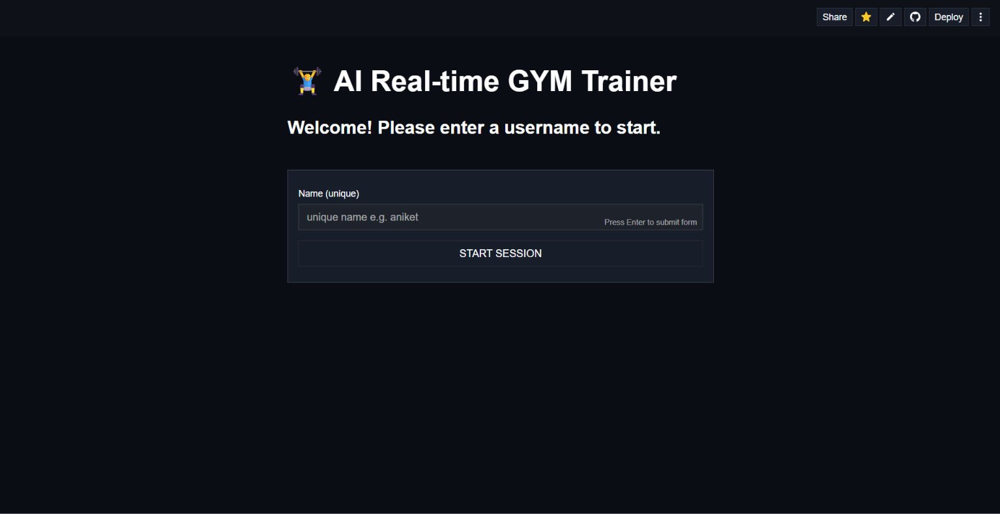
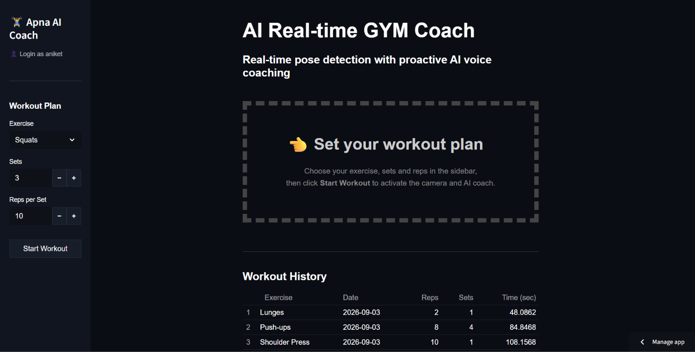
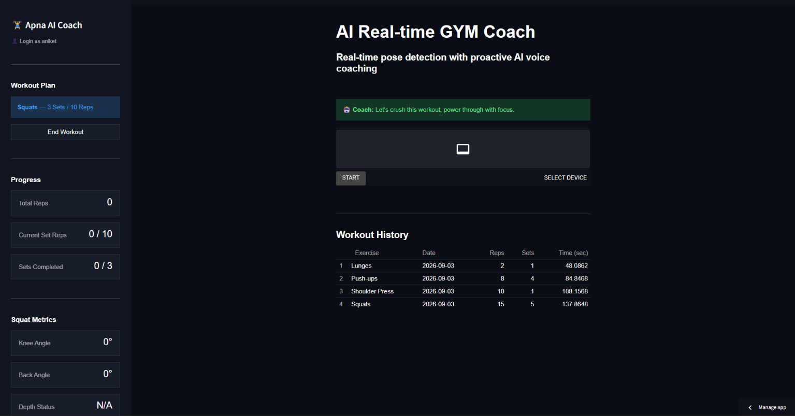

<div align="center">

# 🏋️ AI Real-time GYM Coach

### *Your personal trainer. Powered by your webcam. Coached by AI.*

Real-time pose detection • automatic rep counting • live form analysis • proactive AI voice coaching

<br>

[](https://ai-gym-coach-vision.streamlit.app/)


<br>



</div>

---

## 💡 What is this?

Most people work out without anyone checking their form. **AI Real-time GYM Coach** fixes that.

Open the app, pick an exercise, switch on your webcam, and the coach starts watching. It detects your body pose in real time, counts every rep, tracks your sets, measures joint angles, tells you when your form slips, and **talks to you** like a real trainer.

> 🎯 **No equipment. No wearables. Just a browser and a camera.**

---

## ✨ Feature Highlights

| | Feature | What it does |
|---|---|---|
| 🎥 | **Live pose tracking** | Webcam is analysed frame by frame with MediaPipe |
| 🔢 | **Auto rep & set counting** | No more losing count at rep 7 |
| 📐 | **Joint angle metrics** | Knee, elbow, back and torso angles, live |
| ✅ | **Form status detection** | Instant feedback on depth, alignment, swing and balance |
| 🤖 | **AI coaching** | Context-aware tips generated by an LLM (Groq) |
| 🔊 | **Voice feedback** | The coach speaks to you, hands-free |
| 📜 | **Workout history** | Every completed set is saved per user |
| 🔐 | **Simple login** | Unique username, no password hassle |
| 🌐 | **WebRTC streaming** | Low-latency camera streaming, Twilio-powered ICE servers |
| 🎨 | **Neon athletic UI** | Dark theme, progress rings, colour-coded form cards |

---

## 🏋️ Supported Exercises

<table>
<tr>
<td align="center" width="20%"><h3>🦵<br>Squats</h3>Knee angle<br>Back angle<br>Depth status</td>
<td align="center" width="20%"><h3>💪<br>Push-ups</h3>Elbow angle<br>Body alignment<br>Hip position</td>
<td align="center" width="20%"><h3>🏋️<br>Biceps Curls</h3>Elbow angle<br>Shoulder stability<br>Swing detection</td>
<td align="center" width="20%"><h3>🙌<br>Shoulder Press</h3>Elbow angle<br>Arm extension<br>Back arch</td>
<td align="center" width="20%"><h3>🚶<br>Lunges</h3>Front knee angle<br>Torso angle<br>Balance status</td>
</tr>
</table>

---

## 🧠 How It Works



**Coaching events the AI reacts to:**

`🟢 Workout started` &nbsp; `✅ Set completed` &nbsp; `🏁 Workout completed` &nbsp; `👀 No pose detected` &nbsp; `🔍 Ongoing form check`

---

## 📸 Screenshots

<div align="center">

| 🔐 Login | 🏋️ Workout Setup |
|:---:|:---:|
|  |  |
| Enter a unique username to start | Pick exercise, sets and reps |

| 📊 Progress & Metrics | 🤖 Real-time Coaching |
|:---:|:---:|
|  |  |
| Live rings and colour-coded form cards | Webcam, pose tracking and AI voice coach |

</div>

---

## 🛠️ Tech Stack

| Layer | Technology | Purpose |
|---|---|---|
| 🧱 Core | **Python** | Application logic |
| 🎨 UI | **Streamlit** + custom CSS | Web interface and neon theme |
| 🧍 Vision | **MediaPipe**, **OpenCV**, **NumPy** | Pose detection, frame processing, angle maths |
| 📡 Streaming | **streamlit-webrtc**, **Twilio** | Real-time camera stream and ICE servers |
| 🤖 AI | **Groq** | Coaching responses |
| 🔊 Voice | **Text-to-Speech** | Spoken feedback |
| 💾 Data | **SQLite**, **Pandas** | Persistence and history processing |
| ⚙️ Config | **python-dotenv** | Local environment variables |

---

## 📂 Project Structure

```text
ai-gym-coach-vision/
│
├── 📁 .devcontainer/
├── 📁 .streamlit/
│
├── 📁 core/                 # Base exercise logic
├── 📁 detectors/            # One detector per exercise
│   ├── squat.py
│   ├── pushup.py
│   ├── biceps_curl.py
│   ├── shoulder_press.py
│   └── lunges.py
│
├── 📁 ml_models/
│   └── pose_landmarker_full.task
│
├── 📁 services/
│   ├── auth/                # Login wall
│   ├── coaching/            # LLM, TTS, voice pipeline
│   ├── config/              # Workout configuration
│   ├── persistence/         # SQLite repository
│   ├── state/               # Session defaults
│   ├── tracking/            # Metrics sync, rep & set tracking
│   ├── ui/                  # CSS loader + UI components
│   └── vision/              # Video processor
│
├── 📁 static/
│   ├── style.css            # Neon athletic theme
│   └── AdobeClean.otf
│
├── 📁 screenshots/
├── main.py
├── packages.txt
└── requirements.txt
```

---

## ⚡ Quick Start

<details open>
<summary><b>🖥️ Run locally</b></summary>

<br>

**1. Clone the repository**

```bash
git clone https://github.com/aniketkharose/ai-gym-coach-vision.git
cd ai-gym-coach-vision
```

**2. Create a virtual environment**

```bash
# Windows
python -m venv venv
venv\Scripts\activate

# Linux / macOS
python3 -m venv venv
source venv/bin/activate
```

**3. Install dependencies**

```bash
pip install -r requirements.txt
```

**4. Add your environment variables** (create a `.env` file in the project root)

```env
GROQ_API_KEY=your_groq_api_key
TWILIO_ACCOUNT_SID=your_twilio_account_sid
TWILIO_AUTH_TOKEN=your_twilio_auth_token
```

**5. Launch**

```bash
streamlit run main.py
```

</details>

<details>
<summary><b>☁️ Deploy on Streamlit Cloud</b></summary>

<br>

1. Push the project to GitHub
2. Open [Streamlit Cloud](https://streamlit.io/cloud) and create a new app
3. Select this repository and set the main file to `main.py`
4. Add `GROQ_API_KEY`, `TWILIO_ACCOUNT_SID` and `TWILIO_AUTH_TOKEN` in **Secrets**
5. Deploy 🚀

Every `git push` to the deployed branch redeploys the app automatically.

</details>

---

## 🗃️ Workout History

Every completed set is stored and shown per user:

| Field | Description |
|---|---|
| 🏋️ Exercise | Exercise performed |
| 📅 Date | Workout date |
| 🔢 Reps | Repetitions performed |
| 📦 Sets | Sets completed |
| ⏱️ Time (sec) | Recorded set time |

The dashboard summarises it as total reps, total sets, time trained and active days, plus a daily reps chart.

---

## 🔒 Security Checklist

- [ ] `.env` is **not** committed
- [ ] API keys are **not** inside source code
- [ ] Twilio and Groq credentials live in environment variables or Streamlit Secrets
- [ ] No passwords or private tokens are committed
- [ ] `.gitignore` is configured correctly

> ⚠️ If a key is ever exposed publicly, **revoke and rotate it immediately.**

---

## 🗺️ Roadmap

- [x] Real-time pose detection and rep counting
- [x] 5 exercises with form metrics
- [x] AI coaching with voice feedback
- [x] User login and workout history
- [x] Streamlit Cloud deployment
- [x] Neon athletic UI redesign
- [ ] 📈 Advanced workout analytics
- [ ] 🏆 Fitness goals and achievements
- [ ] 🧠 Improved form classification
- [ ] ➕ More exercises
- [ ] 👤 Personalised workout plans
- [ ] 📱 Better mobile experience
- [ ] 📅 Long-term progress tracking

---

## 📌 Project Status


The core real-time coaching workflow is implemented and deployed. Next up: more exercises, analytics and personalisation.

---

<div align="center">

## 👨‍💻 Author

**Aniket Kharose**

[](https://github.com/aniketkharose)
[](https://github.com/aniketkharose/ai-gym-coach-vision)
[](https://ai-gym-coach-vision.streamlit.app/)

<br>

### ⭐ Liked the project? Drop a star, it keeps me motivated!

<sub>Released under the MIT License. Add a `LICENSE` file to the repository to match.</sub>

</div>